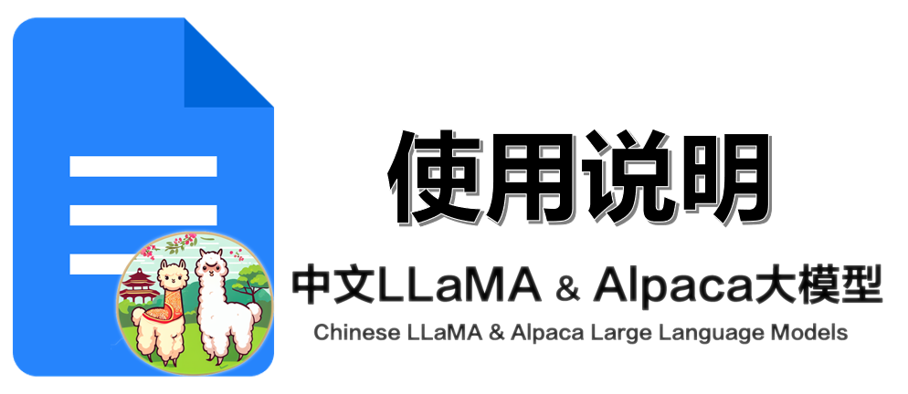

<center></center>

本项目基于[Chinese-LLaMA-Alpaca **V3.1**](https://github.com/ymcui/Chinese-LLaMA-Alpaca/tree/v3.1) 进行使用说明。[Chinese-LLaMA-Alpaca](https://github.com/ymcui/Chinese-LLaMA-Alpaca) 开创了基于LLaMA的中文扩充改进，在原版LLaMA的基础上扩充了中文词表并使用了中文数据进行二次预训练，进一步提升了中文基础语义理解能力。

**项目构成**：
```html
.
├── README.md
├── SHA256.md # LLaMA模型SHA值对比
├── notebooks
│   ├── convert_and_quantize_chinese_alpaca_plus.ipynb
│   └── convert_and_quantize_chinese_llama.ipynb
├── requirements.txt # 依赖文件
└── scripts
    ├── chinese_sp.model # 中文词表文件
    ├── crawl_prompt.py # 1. 通过OpenAI的大模型（如ChatGPT、GPT4等）生成可用于微调的数据
    ├── inference_hf.py # 对微调训练产生的LoRA模型和原始LLaMA模型做推理
    ├── merge_llama_with_chinese_lora.py
    ├── merge_tokenizers.py # 2. 词表扩充
    └── run_clm_pt_with_peft.py
```

## 1.准备数据

不管你是要进行预训练还是微调，你都需要准备数据，数据准备的两种方式：
1. （公开）如果您可以使用公开的标准的可用于微调或者训练的数据，您可以跳过此步骤；
2. （生成）如果您没有合适的微调或者训练数据，您可以使用`scripts/crawl_prompt.py`生成相应数据。基本思路为使用ChatGPT或者其它OpenAI高效模型进行数据生成。

## 2.准备LLaMA权重

```python
# tokenizer
wget https://agi.gpt4.org/llama/LLaMA/tokenizer.model -O ./tokenizer.model
wget https://agi.gpt4.org/llama/LLaMA/tokenizer_checklist.chk -O ./tokenizer_checklist.chk
# 7B
wget https://agi.gpt4.org/llama/LLaMA/7B/consolidated.00.pth -O ./7B/consolidated.00.pth
wget https://agi.gpt4.org/llama/LLaMA/7B/params.json -O ./7B/params.json
wget https://agi.gpt4.org/llama/LLaMA/7B/checklist.chk -O ./7B/checklist.chk
# 13B
wget https://agi.gpt4.org/llama/LLaMA/13B/consolidated.00.pth -O ./13B/consolidated.00.pth
wget https://agi.gpt4.org/llama/LLaMA/13B/consolidated.01.pth -O ./13B/consolidated.01.pth
wget https://agi.gpt4.org/llama/LLaMA/13B/params.json -O ./13B/params.json
wget https://agi.gpt4.org/llama/LLaMA/13B/checklist.chk -O ./13B/checklist.chk
# 30B
wget https://agi.gpt4.org/llama/LLaMA/30B/consolidated.00.pth -O ./30B/consolidated.00.pth
wget https://agi.gpt4.org/llama/LLaMA/30B/consolidated.01.pth -O ./30B/consolidated.01.pth
wget https://agi.gpt4.org/llama/LLaMA/30B/consolidated.02.pth -O ./30B/consolidated.02.pth
wget https://agi.gpt4.org/llama/LLaMA/30B/consolidated.03.pth -O ./30B/consolidated.03.pth
wget https://agi.gpt4.org/llama/LLaMA/30B/params.json -O ./30B/params.json
wget https://agi.gpt4.org/llama/LLaMA/30B/checklist.chk -O ./30B/checklist.chk
# 65B
wget https://agi.gpt4.org/llama/LLaMA/65B/consolidated.00.pth -O ./65B/consolidated.00.pth
wget https://agi.gpt4.org/llama/LLaMA/65B/consolidated.01.pth -O ./65B/consolidated.01.pth
wget https://agi.gpt4.org/llama/LLaMA/65B/consolidated.02.pth -O ./65B/consolidated.02.pth
wget https://agi.gpt4.org/llama/LLaMA/65B/consolidated.03.pth -O ./65B/consolidated.03.pth
wget https://agi.gpt4.org/llama/LLaMA/65B/consolidated.04.pth -O ./65B/consolidated.04.pth
wget https://agi.gpt4.org/llama/LLaMA/65B/consolidated.05.pth -O ./65B/consolidated.05.pth
wget https://agi.gpt4.org/llama/LLaMA/65B/consolidated.06.pth -O ./65B/consolidated.06.pth
wget https://agi.gpt4.org/llama/LLaMA/65B/consolidated.07.pth -O ./65B/consolidated.07.pth
wget https://agi.gpt4.org/llama/LLaMA/65B/params.json -O ./65B/params.json
wget https://agi.gpt4.org/llama/LLaMA/65B/checklist.chk -O ./65B/checklist.chk
```

您需要下载不同大小参数的LLaMA模型权重，参数越大的模型权重体积越大，精度相对较好，微调和训练时间也相对较长。一般情况下，7B或者13B模型将是大部分人的选择。

务必确认LLaMA基模型的完整性，检查是否与[SHA256.md](SHA256.md) 所示的值一致，否则无法进行合并操作。

## 3.转化为HF格式权重

```python
# 安装依赖库
pip install git+https://github.com/huggingface/transformers

# 转化HF权重
python -m transformers.models.llama.convert_llama_weights_to_hf \
   --input_dir llama-weights \
   --model_size 7B \
   --output_dir llama-hf-weights
  
> python -m transformers.models.llama.convert_llama_weights_to_hf --input_dir ./ --model_size 7B --output_dir ./output/7B-hf
```

如果你不想要自己手动转化，也可以使用别人转化好的LLaMA-HF模型，[pinkmanlove](https://huggingface.co/pinkmanlove) 有在HuggingFace提供转化好的LLaMA-HF权重，如果失效可以在`HuggingFace-Models`搜索其他人转化好的。

## 4.训练和微调模型

整个训练和微调过程包括三个步骤：
1. 词表扩充；
2. 预训练（可选）；
3. 指令微调；

### 4.1词表扩充

```python
python scripts/merge_tokenizers.py \
  --llama_tokenizer_dir llama_tokenizer_dir \
  --chinese_sp_model_file chinese_sp_model_file

> python scripts/merge_tokenizers.py --llama_tokenizer_dir output/7B-hf --chinese_sp_model_file scripts/chinese_sp.model
```
参数说明：
- `llama_tokenizer_dir`:指向存放原版LLaMA tokenizer的目录；
- `chinese_sp_model_file`:指向用sentencepiece训练的中文词表文件（chinese_sp.model）；

### 4.2预训练（可选）

在预训练阶段，使用通用中文语料在原版LLaMA权重的基础上进一步进行预训练。该过程又分为两个阶段：

- 第一阶段：冻结transformer参数，仅训练embedding，在尽量不干扰原模型的情况下适配新增的中文词向量；
- 第二阶段：使用LoRA技术，为模型添加LoRA权重（adapter），训练embedding的同时也更新LoRA参数；

预训练的第一阶段中模型收敛速度较慢，如果不是有特别充裕的时间和计算资源，建议跳过该阶段。预训练的第二阶段训练如下（单机单卡）：
```python
########参数设置########
lr=2e-4
lora_rank=8
lora_alpha=32
lora_trainable="q_proj,v_proj,k_proj,o_proj,gate_proj,down_proj,up_proj"
modules_to_save="embed_tokens,lm_head"
lora_dropout=0.05

pretrained_model=path/to/hf/llama/dir
chinese_tokenizer_path=path/to/chinese/llama/tokenizer/dir
dataset_dir=path/to/pt/data/dir
data_cache=temp_data_cache_dir
per_device_train_batch_size=1
per_device_eval_batch_size=1
training_steps=100
gradient_accumulation_steps=1
output_dir=output_dir

deepspeed_config_file=ds_zero2_no_offload.json

########启动命令########
torchrun --nnodes 1 --nproc_per_node 1 run_clm_pt_with_peft.py \
    --deepspeed ${deepspeed_config_file} \
    --model_name_or_path ${pretrained_model} \
    --tokenizer_name_or_path ${chinese_tokenizer_path} \
    --dataset_dir ${dataset_dir} \
    --data_cache_dir ${data_cache} \
    --validation_split_percentage 0.001 \
    --per_device_train_batch_size ${per_device_train_batch_size} \
    --per_device_eval_batch_size ${per_device_eval_batch_size} \
    --do_train \
    --seed $RANDOM \
    --fp16 \
    --max_steps ${training_steps} \
    --lr_scheduler_type cosine \
    --learning_rate ${lr} \
    --warmup_ratio 0.05 \
    --weight_decay 0.01 \
    --logging_strategy steps \
    --logging_steps 10 \
    --save_strategy steps \
    --save_total_limit 3 \
    --save_steps 500 \
    --gradient_accumulation_steps ${gradient_accumulation_steps} \
    --preprocessing_num_workers 8 \
    --block_size 512 \
    --output_dir ${output_dir} \
    --overwrite_output_dir \
    --ddp_timeout 30000 \
    --logging_first_step True \
    --lora_rank ${lora_rank} \
    --lora_alpha ${lora_alpha} \
    --trainable ${lora_trainable} \
    --modules_to_save ${modules_to_save} \
    --lora_dropout ${lora_dropout} \
    --torch_dtype float16 \
    --gradient_checkpointing \
    --ddp_find_unused_parameters False
```
参数说明：
- `--model_name_or_path`: 原版HF格式的LLaMA模型所在目录；
- `--tokenizer_name_or_path`: Chinese-LLaMA tokenizer所在的目录（merge_tokenizers.py合成的结果）；
- `--dataset_dir`: 预训练数据的目录，可包含多个以txt结尾的纯文本文件；
- `--data_cache_dir`: 指定一个存放数据缓存文件的目录；

多机多卡：
```python
torchrun \
  --nnodes ${num_nodes} \
  --nproc_per_node ${num_gpu_per_node} 
  --node_rank ${node_rank} \
  --master_addr ${master_addr} \
  --master_port ${master_port} \
  run_clm_pt_with_peft.py \
    ...
```

中文LLaMA模型在原版的基础上扩充了中文词表，使用了中文通用纯文本数据进行二次预训练。这里作者提供了两种下载这些预训练权重的方式，而不需要我们自己花费资源训练：

- （1）Google Drive或者百度网盘

| 模型名称                 | 训练数据 | 重构模型 | 大小 |                    LoRA下载                   |
| :----------------------- | :------: | :--------------------: | :----------------: | :----------------------------------------------------------: |
| Chinese-LLaMA-7B         | 通用20G  |      原版LLaMA-7B      |        770M        | [[百度网盘]](https://pan.baidu.com/s/1oORTdpr2TvlkxjpyWtb5Sw?pwd=33hb)</br>[[Google Drive]](https://drive.google.com/file/d/1iQp9T-BHjBjIrFWXq_kIm_cyNmpvv5WN/view?usp=sharing) |
| Chinese-LLaMA-Plus-7B ⭐️  | 通用120G |      原版LLaMA-7B      |        790M        | [[百度网盘]](https://pan.baidu.com/s/1zvyX9FN-WSRDdrtMARxxfw?pwd=2gtr)</br>[[Google Drive]](https://drive.google.com/file/d/1N97m3rBj-rp-J1X8rgRfluyomEscfAq0/view?usp=sharing) |
| Chinese-LLaMA-13B        | 通用20G  |     原版LLaMA-13B      |         1G         | [[百度网盘]](https://pan.baidu.com/s/1BxFhYhDMipW7LwI58cGmQQ?pwd=ef3t)<br/>[[Google Drive]](https://drive.google.com/file/d/12q9EH4mfKRnoKlbkkhzv1xDwWnroo9VS/view?usp=sharing) |
| Chinese-LLaMA-Plus-13B ⭐️ | 通用120G |     原版LLaMA-13B      |         1G         | [[百度网盘]](https://pan.baidu.com/s/1VGpNlrLx5zHuNzLOcTG-xw?pwd=8cvd)<br/>[[Google Drive]](https://drive.google.com/file/d/1q0L5Me_1j_9iiRRNfuEFUt3SOjQo3-g3/view?usp=share_link) |

- （2）可以在🤗Model Hub下载以上所有模型，并且使用[transformers](https://github.com/huggingface/transformers)和[PEFT](https://github.com/huggingface/peft)调用中文LLaMA模型。以下模型调用名称指的是使用`.from_pretrained()`中指定的模型名称。

| 模型名                  | 模型调用名称                            |                             链接                             |
| ----------------------- | :-------------------------------------- | :----------------------------------------------------------: |
| Chinese-LLaMA-7B        | ziqingyang/chinese-llama-lora-7b        | [Model Hub Link](https://huggingface.co/ziqingyang/chinese-llama-lora-7b) |
| Chinese-LLaMA-Plus-7B   | ziqingyang/chinese-llama-plus-lora-7b   | [Model Hub Link](https://huggingface.co/ziqingyang/chinese-llama-plus-lora-7b) |
| Chinese-LLaMA-13B       | ziqingyang/chinese-llama-lora-13b       | [Model Hub Link](https://huggingface.co/ziqingyang/chinese-llama-lora-13b) |
| Chinese-LLaMA-Plus-13B  | ziqingyang/chinese-llama-plus-lora-13b  | [Model Hub Link](https://huggingface.co/ziqingyang/chinese-llama-plus-lora-13b) |


### 4.3指令微调

训练方案同样采用了LoRA进行高效精调，并进一步增加了可训练参数数量。

单机单卡：
```python
########参数部分########
lr=1e-4
lora_rank=8
lora_alpha=32
lora_trainable="q_proj,v_proj,k_proj,o_proj,gate_proj,down_proj,up_proj"
modules_to_save="embed_tokens,lm_head"
lora_dropout=0.05

pretrained_model=path/to/hf/llama/or/merged/llama/dir/or/model_id
chinese_tokenizer_path=path/to/chinese/llama/tokenizer/dir
dataset_dir=path/to/sft/data/dir
per_device_train_batch_size=1
per_device_eval_batch_size=1
training_steps=100
gradient_accumulation_steps=1
output_dir=output_dir
peft_model=path/to/peft/model/dir
validation_file=validation_file_name

deepspeed_config_file=ds_zero2_no_offload.json

########启动命令########
torchrun --nnodes 1 --nproc_per_node 1 run_clm_sft_with_peft.py \
    --deepspeed ${deepspeed_config_file} \
    --model_name_or_path ${pretrained_model} \
    --tokenizer_name_or_path ${chinese_tokenizer_path} \
    --dataset_dir ${dataset_dir} \
    --validation_split_percentage 0.001 \
    --per_device_train_batch_size ${per_device_train_batch_size} \
    --per_device_eval_batch_size ${per_device_eval_batch_size} \
    --do_train \
    --do_eval \
    --seed $RANDOM \
    --fp16 \
    --max_steps ${training_steps} \
    --lr_scheduler_type cosine \
    --learning_rate ${lr} \
    --warmup_ratio 0.03 \
    --weight_decay 0 \
    --logging_strategy steps \
    --logging_steps 10 \
    --save_strategy steps \
    --save_total_limit 3 \
    --evaluation_strategy steps \
    --eval_steps 250 \
    --save_steps 500 \
    --gradient_accumulation_steps ${gradient_accumulation_steps} \
    --preprocessing_num_workers 8 \
    --max_seq_length 512 \
    --output_dir ${output_dir} \
    --overwrite_output_dir \
    --ddp_timeout 30000 \
    --logging_first_step True \
    --lora_rank ${lora_rank} \
    --lora_alpha ${lora_alpha} \
    --trainable ${lora_trainable} \
    --modules_to_save ${modules_to_save} \
    --lora_dropout ${lora_dropout} \
    --torch_dtype float16 \
    --validation_file ${validation_file} \
    --peft_path ${peft_model} \
    --gradient_checkpointing \
    --ddp_find_unused_parameters False
```
参数说明：
- `--tokenizer_name_or_path`: Chinese-Alpaca tokenizer所在的目录（merge_tokenizers.py合成的结果）；
- `--dataset_dir`: 指令精调数据的目录，包含一个或多个以json结尾的Stanford Alpaca格式的指令精调数据文件；
- `--validation_file`: 用作验证集的单个指令精调文件，以json结尾，同样遵循Stanford Alpaca格式；

所谓Stanford Alpaca格式即：
```json
[
  {"instruction" : ...,
   "input" : ...,
   "output" : ...},
  ...
]
```

配置说明：

- 如果想继续训练Chinese-Alpaca模型的LoRA权重：

    - `--model_name_or_path`: 原版HF格式LLaMA模型（如果继续训练非Plus Alpaca模型）或合并Chinese-LLaMA-Plus-LoRA后的Chinese-LLaMA模型（如果继续训练Plus模型）；
    - `--peft_path`: Chinese-Alpaca的LoRA权重目录；

无需指定`--lora_rank`、`--lora_alpha`、`--lora_dropout`、`--trainable`和`--modules_to_save`参数。

- 如果想基于中文Chinese-LLaMA训练全新的指令精调LoRA权重：

    - `--model_name_or_path`: 合并对应Chinese-LLaMA-LoRA后的HF格式Chinese-LLaMA模型（无论是否是Plus模型）；
    - `--peft_path`: 勿提供此参数，并且从脚本中删除 --peft_path；

需指定`--lora_rank`、`--lora_alpha`、`--lora_dropout`、`--trainable`和`--modules_to_save`参数。

多机多卡：
```python
torchrun \
  --nnodes ${num_nodes} \
  --nproc_per_node ${num_gpu_per_node} 
  --node_rank ${node_rank} \
  --master_addr ${master_addr} \
  --master_port ${master_port} \
  run_clm_sft_with_peft.py \
    ...
```

## 合并权重（HF和LoRA）

### 单LoRA权重合并

> 适用于 Chinese-LLaMA, Chinese-LLaMA-Plus, Chinese-Alpaca

```python
python scripts/merge_llama_with_chinese_lora.py \
    --base_model path_to_original_llama_hf_dir \
    --lora_model path_to_chinese_llama_or_alpaca_lora \
    --output_type [pth|huggingface]
    --output_dir path_to_output_dir 
```

参数说明：
- `--base_model`：存放HF格式的LLaMA模型权重和配置文件的目录
- `--lora_model`：中文LLaMA/Alpaca LoRA解压后文件所在目录，也可使用🤗Model Hub模型调用名称
- `--output_type`: 指定输出格式，可为`pth`或`huggingface`。若不指定，默认为`pth`
- `--output_dir`：指定保存全量模型权重的目录，默认为./
（可选）--offload_dir：对于低内存用户需要指定一个offload缓存路径

关于`output_type`的更进一步说明：
- `.pth`文件可用于：使用llama.cpp工具进行量化和部署；
- `.bin`文件可用于：使用Transformers进行推理；使用text-generation-webui搭建界面；

### 多LoRA权重合并

> 合并Chinese-Alpaca-Plus需要提供两个LoRA权重，分别为Chinese-LLaMA-Plus-LoRA和Chinese-Alpaca-Plus-LoRA

```python
python scripts/merge_llama_with_chinese_lora.py \
    --base_model path_to_original_llama_hf_dir \
    --lora_model path_to_chinese_llama_plus_lora,path_to_chinese_alpaca_plus_lora \
    --output_type [pth|huggingface]
    --output_dir path_to_output_dir 
```

⚠️ 两个LoRA模型的顺序很重要，不能颠倒。先写LLaMA-Plus-LoRA然后写Alpaca-Plus-LoRA。 ⚠️

## 运行模型

```python
CUDA_VISIBLE_DEVICES=0 python scripts/inference_hf.py \
    --base_model path_to_original_llama_hf_dir \
    --lora_model path_to_chinese_llama_or_alpaca_lora \
    --with_prompt \
    --interactive
```

如果之前已执行了`merge_llama_with_chinese_lora_to_hf.py`脚本将lora权重合并，那么无需再指定`--lora_model`，启动方式更简单：
```python
CUDA_VISIBLE_DEVICES=0 python scripts/inference_hf.py \
    --base_model path_to_merged_llama_or_alpaca_hf_dir \
    --with_prompt \
    --interactive
```

## 参考

- https://github.com/ymcui/Chinese-LLaMA-Alpaca
